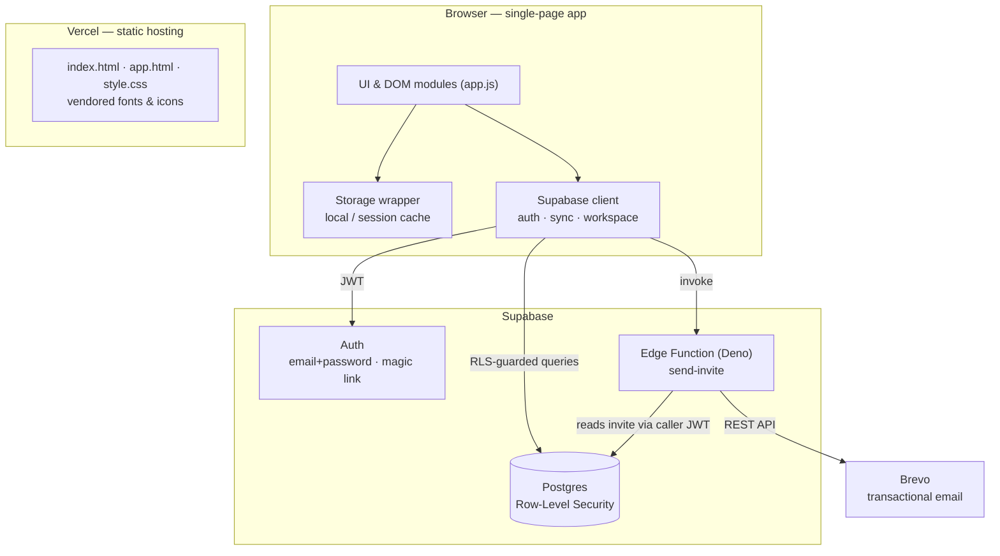
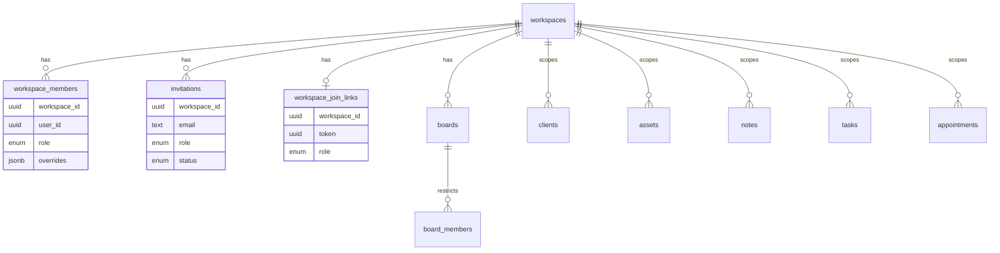
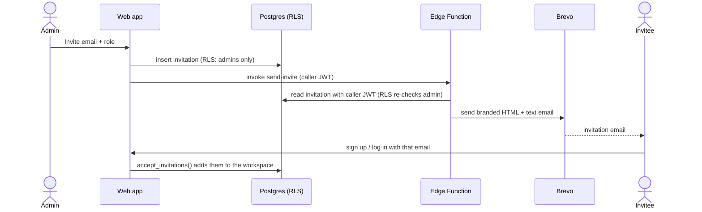

# Skelety

**A production multi-tenant workspace app — links, assets, notes, tasks, Kanban boards and a calendar — that I took from idea to go-live end-to-end, using AI-assisted development.**

🔗 **Live:** [skelety.app](https://skelety.app) · **Built with:** Supabase (Postgres + RLS + Edge Functions) · Brevo · Vercel · Vanilla JS


> I'm an **IT Delivery Specialist / Project Coordinator**, not a full-time developer. I coordinate IT projects from kick-off to go-live and act as the bridge between business and engineering. I built Skelety to do that bridge *hands-on*: own a real product across its whole lifecycle — requirements, architecture decisions, third-party integrations, security & compliance, deployment and operations — **using AI-assisted development (Claude Code)**, the same accelerated delivery approach I bring to real projects.

<!-- 📸 Add a screenshot or a short GIF of the app here — highest-impact addition to this README. -->

---

## Why I built it

Day to day I gather requirements, run go-lives, manage change and keep delivery aligned across PMO, business and technical teams. Skelety is my way of staying fluent in *what* I deliver: a small but complete **enterprise-style SaaS** — multi-tenant, role-based, with invitations and compliance — so I can speak the same language as the engineers I work with and make better delivery and scoping decisions.

It doubles as a demonstration of **AI-accelerated delivery**: one person owning the full stack of a shipped product by leveraging modern AI tooling — a capability I see as central to modern IT delivery and consulting.

---

## What this demonstrates (for a delivery / product role)

| Delivery competency | How Skelety shows it |
|---|---|
| **End-to-end ownership** | Idea → design → build → integrate → deploy → operate, on a live domain |
| **Requirements → solution** | Turned feature needs into a concrete data model, permissions and flows |
| **Architecture & make/buy decisions** | Chose Supabase (auth/DB/RLS) + Brevo (email) + Vercel over building from scratch |
| **Third-party integration** | Auth, transactional email, DNS/email deliverability, hosting |
| **Non-functional ownership** | Security (RLS, headers), privacy/GDPR pages, account deletion, email authentication |
| **Access & governance** | Roles, per-section permissions, per-board access — the stuff enterprise clients ask for |
| **Technical communication** | The diagrams below — I can discuss the system credibly with a dev team |

---

## Architecture



**Offline-first.** The UI reads/writes synchronously to the browser; a sync layer mirrors changes to Supabase. When signed in, data lives in a **session cache that is wiped on logout**, with Supabase as the source of truth.

---

## Data model &amp; multi-tenancy

Every record is scoped to a *workspace*. Access is enforced **in the database** (Row-Level Security), never trusted from the client — read = "is a member", write = "can edit this section".



- **Roles**: owner / admin / editor / contributor / viewer, with optional **per-section overrides**.
- **Per-board access**: a board is visible only to its members.
- **Least privilege**: the shareable-link token lives in an admin-only table; joining goes through a controlled server-side function that validates the token.

---

## Invitation flow (email)



Authorization is *implicit*: the server function reads the invitation with the caller's own token, so the database itself guarantees only an admin can trigger a send — and the email provider's API key never touches the client.

---

## Security &amp; compliance ownership

The parts that don't show in a demo but matter in real delivery:

| Concern | Approach |
|---|---|
| Authorization | **Row-Level Security** in Postgres is the boundary — the client is never trusted |
| Input safety | All user data HTML-escaped; URLs restricted to `http`/`https`; no inline event handlers |
| Secrets | Email provider key kept in server-side function secrets, never in the client |
| Transport / headers | Security headers + Content-Security-Policy configured at the edge |
| Email deliverability | Sending domain authenticated with **SPF, DKIM and DMARC** |
| Privacy | Privacy policy, terms, cookie notice; data owner declared |
| Data lifecycle | Session-only cache wiped on logout; **account deletion** with cascading data removal |

---

## Features

- **Elements &amp; Links** — a table view with two-level groups (folders), reusable tags, search & filters, CSV import/export.
- **Assets · Notes · Tasks** — reusable items, quick notes, task lists.
- **Kanban** — up to 3 boards, dynamic columns, drag-and-drop, per-board collaborator access.
- **Calendar** — monthly + list view for appointments, filters, CSV import/export.
- **Dashboard** — KPIs, donut/pie charts and a completion trend over time.
- **Collaboration** — workspaces, member management, roles with per-section permissions, email invites and shareable join links.
- **UX** — light/dark themes, responsive collapsible sidebar, accessible modal/dialogs. Works offline; fonts &amp; icons are vendored (no CDN).

---

## Tech &amp; delivery choices

| Area | Choice | Rationale |
|---|---|---|
| Backend | **Supabase** (Postgres, Auth, RLS, Edge Functions) | Real auth + authorization without operating my own servers — faster, safer delivery |
| Email | **Brevo** via a Deno Edge Function | Keep the provider secret server-side; branded, authenticated emails |
| Hosting | **Vercel** + custom domain | Deploy-on-push, edge headers, HTTPS by default |
| Frontend | **Vanilla HTML/CSS/JS** (no build) | Kept the delivery surface small and dependency-free for a solo, AI-assisted build |
| Method | **Claude Code** (AI-assisted development) | The same AI-accelerated approach I apply to real delivery work |

---

## Run it locally

No build, no package manager:

```bash
cd Panel-main && python3 -m http.server 8000   # then open http://localhost:8000
```

With placeholder Supabase config the app runs in **local mode** (browser storage only), no account needed. To enable auth + cloud sync, fill `supabase/config.js` and apply the SQL under `supabase/` (see `SUPABASE_SETUP.md`).

---

## Roadmap

Honest next steps I'd prioritize if this went further:

- Automated tests + a CI check on push
- TypeScript on the Supabase layer for safer refactors
- Optional realtime sync between collaborators (Supabase Realtime)
- Flip the Content-Security-Policy from report-only to enforcing

---

<sub>Built by <b>Stefano Sabeni</b> — IT Delivery Specialist / Project Coordinator — as a hands-on portfolio of end-to-end, AI-assisted product delivery.</sub>
